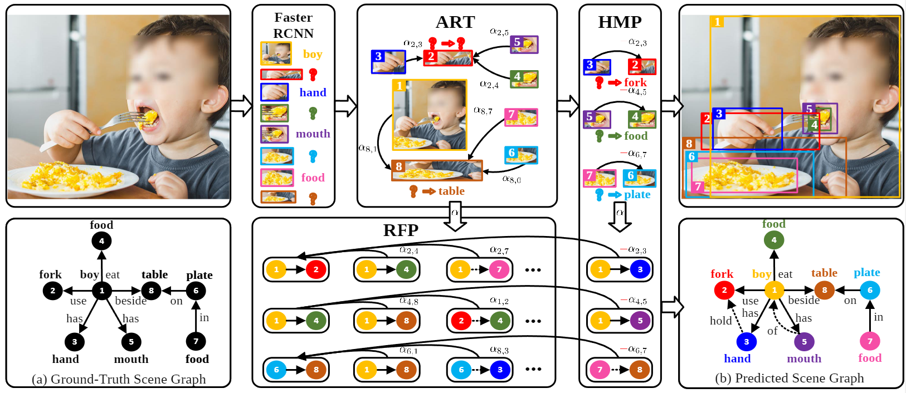

# Heterophily Learning Network (HL-Net)

[](https://www.python.org/)


This is an official implementation for CVPR 2022 paper "[HL-Net: Heterophily Learning Network for Scene Graph Generation](https://openaccess.thecvf.com/content/CVPR2022/papers/Lin_HL-Net_Heterophily_Learning_Network_for_Scene_Graph_Generation_CVPR_2022_paper.pdf)". 


## Contents

0. [Installation](#Installation)
1. [Dataset setup](#Dataset-setup)
2. [Config Introduction](#Config-Introduction)
3. [Training](#Training)
4. [Validation and Testing](#Validation-and-Testing)
5. [Models](#Models)

## Introduction

This project is based on the code of [Scene Graph Benchmark in Pytorch](https://github.com/KaihuaTang/Scene-Graph-Benchmark.pytorch). 

**Method overview**




## Installation

- Clone this repo
```bash
git clone https://github.com/siml3/HL-Net.git
cd HL-Net
```

-  Create a conda virtual environment and activate it (**optional**)
```bash
conda create -n hlnet -y
conda activate hlnet
```

- Prepare proper pytorch environment for your device. 

+ Install dependencies

  ```
  conda install ipython
  conda install scipy
  conda install h5py
  pip install ninja yacs cython matplotlib tqdm opencv-python-headless overrides
  
  
  git clone https://github.com/cocodataset/cocoapi.git
  cd cocoapi/PythonAPI
  python setup.py build_ext install
  cd ../../
  
  # GPU and Cuda environment is necessary for proper compilation of this repo
  git clone https://github.com/NVIDIA/apex.git
  cd apex
  python setup.py install --cuda_ext --cpp_ext
  cd ../
  ```

  

- Compile extensions and install this repo in `develop` mode

  ```
  python setup.py build develop
  ```

  

## Dataset
Please refer to the [DATASET.md](./DATASET.md)


## Training
#### Detector Fine-tune (optional)

```
CUDA_VISIBLE_DEVICES=0,1,2,3 python -m torch.distributed.launch --master_port 10001 --nproc_per_node=4 tools/detector_pretrain_net.py --config-file "configs/e2e_relation_detector_X_101_32_8_FPN_1x.yaml" SOLVER.IMS_PER_BATCH 8 TEST.IMS_PER_BATCH 4 DTYPE "float32" SOLVER.MAX_ITER 50000 SOLVER.STEPS "(30000, 45000)" SOLVER.VAL_PERIOD 2000 SOLVER.CHECKPOINT_PERIOD 2000 MODEL.RELATION_ON False SOLVER.PRE_VAL False OUTPUT_DIR /path/to/output 
```

###  Training on Scene Graph Generation

The training scripts are available in the folder [scripts](./scripts/)

If you have multi gpus, try the command as the follows for SGCLS:
```bash
# four cards
PYTHONPATH=$PWD CUDA_VISIBLE_DEVICES=0,1,2,3 python -m torch.distributed.launch --master_port 10022 --nproc_per_node=4 tools/relation_train_net.py --config-file "configs/e2e_relation_X_101_32_8_FPN_1x.yaml" MODEL.ROI_RELATION_HEAD.USE_GT_BOX True MODEL.ROI_RELATION_HEAD.USE_GT_OBJECT_LABEL False MODEL.PRETRAINED_DETECTOR_CKPT checkpoints/pretrained_faster_rcnn/model_final.pth OUTPUT_DIR "exp/HL-Net-sgcls" SOLVER.IMS_PER_BATCH 12 TEST.IMS_PER_BATCH 4 DTYPE "float16" SOLVER.PRE_VAL True MODEL.ROI_RELATION_HEAD.PREDICTOR HLNetPredictor MODEL.ROI_RELATION_HEAD.MP_LAYER_NUM 5 SOLVER.BASE_LR 0.0025 GLOVE_DIR glove MODEL.ROI_RELATION_HEAD.PPR_ALPHA -0.5
```


## Testing
```bash
gpu_id=0,1
port=10086
gpu_num=2
output_dir="home/XXXX/exp/.."

PYTHONPATH=$PWD CUDA_VISIBLE_DEVICES=${gpu_id} python -m torch.distributed.launch --master_port ${port} --nproc_per_node=${gpu_num} tools/relation_test_net.py --config-file "${output_dir}/config.yml" MODEL.ROI_RELATION_HEAD.USE_GT_BOX True MODEL.ROI_RELATION_HEAD.USE_GT_OBJECT_LABEL False OUTPUT_DIR "${output_dir}" TEST.IMS_PER_BATCH ${gpu_num} DTYPE "float16" GLOVE_DIR glove
```


## Models
Here we provide our pretrained model via BaiduNetDisk:

Link：https://pan.baidu.com/s/1ujghYTjDB8MEgujQVVhCEQ Extraction code：1020

or Google Drive：

Link：https://drive.google.com/drive/folders/1BWaS6Fy7imfKgt6lcRQvSRMZroFkz8LD?usp=sharing

## Citation

If HL-Net is helpful for your research, we'd really appreciate it if you could cite this paper:
```
@inproceedings{lin2022hl,
  title={HL-Net: Heterophily Learning Network for Scene Graph Generation},
  author={Lin, Xin and Ding, Changxing and Zhan, Yibing and Li, Zijian and Tao, Dacheng},
  booktitle={Proceedings of the IEEE/CVF Conference on Computer Vision and Pattern Recognition},
  pages={19476--19485},
  year={2022}
}
```
